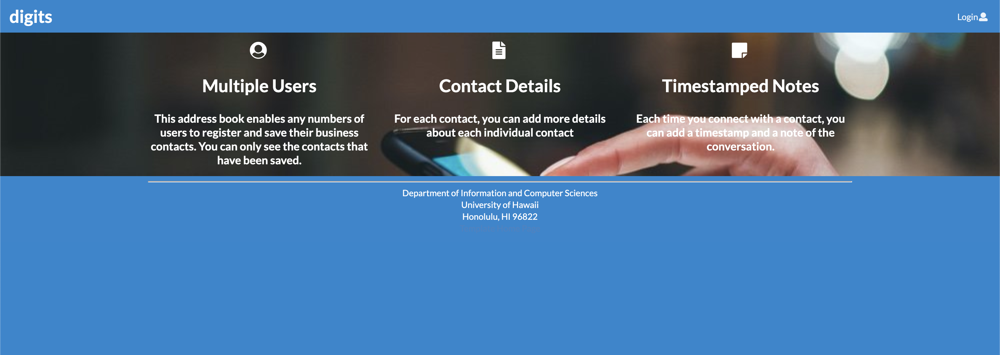
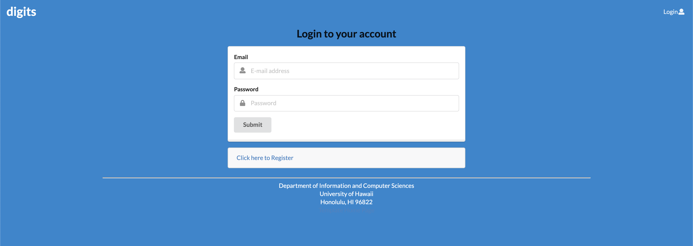
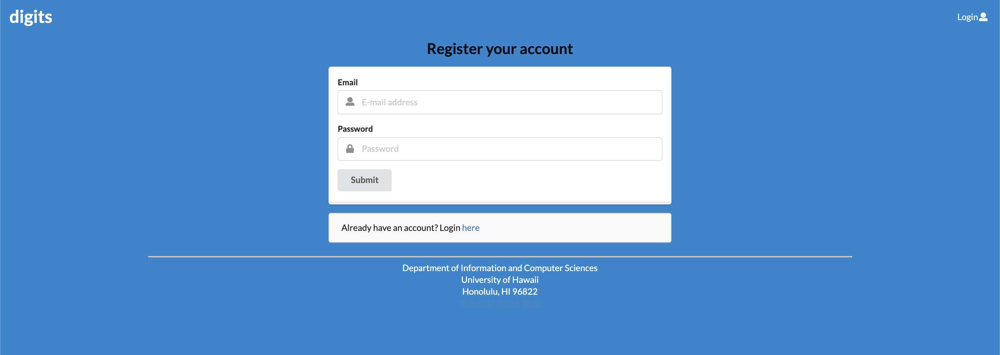
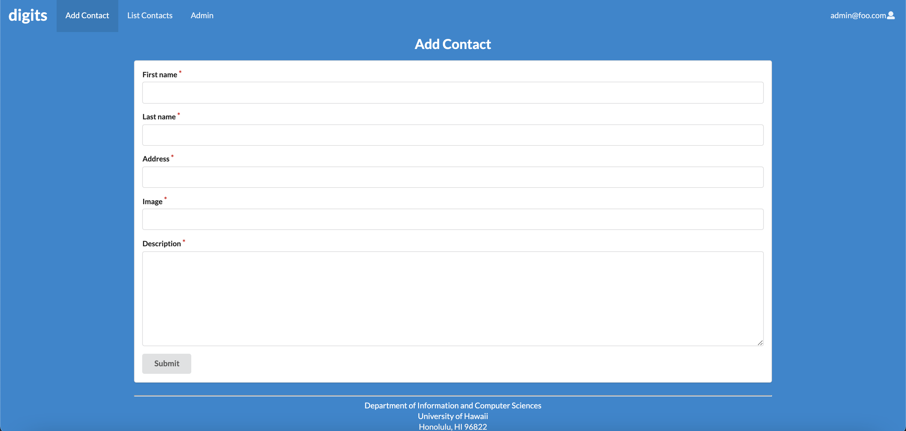
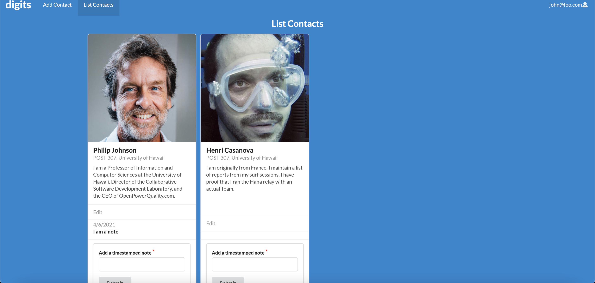
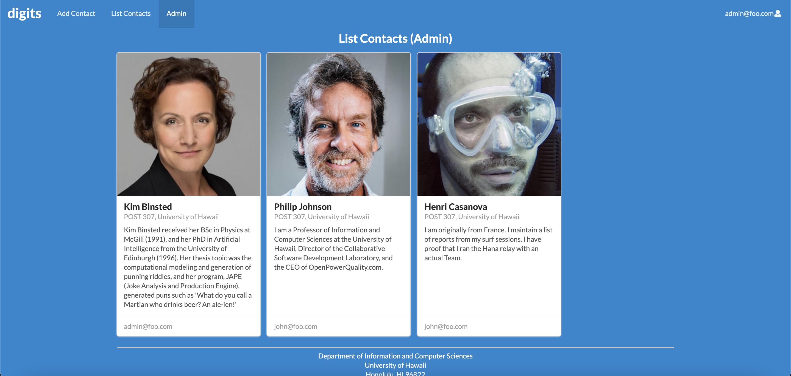

## digits

digits is a web application that allows users to create and interact with contacts of their choice.

## installation

First, install [meteor](https://www.meteor.com/developers/install)

Second, download a copy of [digits](https://github.com/philipmjohnson/digits), with permission, from the author.

Third, open terminal and cd into '.../digits/app', where '...' is your directory containing digits.

Fourth, install meteor with '$ meteor npm install', followed by '$ meteor npm run start' to start the application.

Lastly, as soon as your terminal says that your application is running at [http://localhost:3000](http://localhost:3000), open a web browser of your choice and enter [http://localhost:3000](http://localhost:3000) onto the url.

## pages

Initially, you will reach the landing page once you enter [http://localhost:3000](http://localhost:3000). It should look like this

To use the web application, log in with certified credentials, or sign up if you do not have one. To do so, click on 'login' at the right top corner and it will take you to either the login page,

Or the signup page to create a new account.

After you signed in, you are taken back to the landing page, but with more options to explore the web application on the navbar. If you are a new user, you can start adding contacts to your profile. Just click on the 'Add Contact' button next to 'digits' on the top left. This will take you to the 'Add Contact' page.

After creating some new contact, your list of contacts can be found on the 'List Contact' page. You can access it on the top left next to 'Add Contact'. It should look something similar to the following pic. 

In your list of contacts, you are able to find information that you've inputed for those contacts. You can also input some notes about that contact.

If you are assigned an admin role, you will have functionality similar to a standard user, but with more viewability. This means you are able to see ALL the contact that are stored in the collection. Once you signed in with an admin account, a new button next to 'List Contact' called 'Admin' will appear. This 'Admin' button will lead you to a page that allows you to see ALL contacts from all account.

